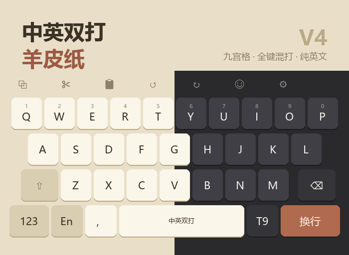

# 中英双打羊皮纸

[元书输入法](https://apps.apple.com/us/app/元书输入法/id6744464701)（iOS）的
**输入方案 + 键盘皮肤**整套配置。

适合同时有中英文混打输入需求的人群。



## 特点

### 三套键盘，各挂一套 Rime 方案

| 键盘 | Rime 方案 | 说明 |
|---|---|---|
| **26 键中英混打**（主键盘） | `rime_ice` | 中英文同时出候选 |
| **九宫格** | `t9` | 纯中文，方案层已关闭英文翻译器 |
| **纯英文** | `English Nano` | 有词库、有补全、有错拼容错 |

切换键**同时切键盘和方案**（`combine` 动作），不会出现「键盘换了方案没换」。

### 英文输入做了什么

上游雾凇的默认取向是「中文为主，英文偶尔冒头」，本项目相反：

- **移除 `reduce_english_filter`** —— 上游默认把一批英文单词压到第 2 位之后
- **移除 `corrector`** —— 它会把 `amazon` 纠成「阿妈粽」抢占首选
  （代价是失去中文错音提示，补丁中留有注释可一键恢复）
- **英文词库重建** —— 43,005 条基础词条 + 196,143 条错拼变体
- **前缀补全** —— 打 `inter` 直接出 `international`
- **错拼容错** —— 打错也能出正确单词

错拼容错覆盖三种错型：

| 错型 | 例 |
|---|---|
| 漏字母 | `intersting` → interesting，`comitted` → committed |
| 相邻换位 | `recieve` → receive，`amatuer` → amateur |
| 元音互换 | `seperate` → separate，`definately` → definitely |

变体权重压到 8（正常词条中位数 279），正确拼写始终排在前面。
变体若本身是真英文单词则丢弃，因此不会出现打 `hat` 跳出 heat/that 的情况。

### 配色

浅色为羊皮纸护眼底，深色为柔和灰（非纯黑），按键文字对比度约 9:1。

## 安卓

Rime 方案层可移植到 **[fcitx5-android](https://github.com/fcitx5-android/fcitx5-android)**
（需另装 Rime 插件）或 **同文输入法 Trime**：

```bash
./build-rime.sh android    # → dist/rime-android
```

| App | 配置目录 |
|---|---|
| fcitx5-android | `/Android/data/org.fcitx.fcitx5.android/files/data/rime` |
| 同文 Trime | `/rime` |

**两点限制：**

1. **没有九宫格。** `t9.schema.yaml` 的 `engine/processors` 第一项是
   `t9_processor`——那是仓输入法与元书**编译进 App 的原生组件，不属于
   librime**，安卓端加载会失败。故安卓版只保留 26 键中英混打与纯英文两套方案。
2. **皮肤完全不可移植。** 元书皮肤格式是其专有；且本项目「切键盘同时切方案」
   依赖 `combine` / `switchRimeSchema` / 自定义键盘，均为元书特有能力，
   安卓端无对等物。键盘外观请用所选 App 自带的主题另配。

英文词库、错拼容错、前缀补全等核心改进都在方案层，跨平台通用。

## 目录结构

```
vendor/rime-ice/     上游雾凇基底（不计入版本控制，用 fetch-upstream.sh 拉取）
src/
  patches/           Rime 补丁，只打补丁不改上游文件
  en_dicts/          生成的英文词库
  tools/             词库构建脚本与场景词表
skin/
  jsonnet/           皮肤源码
  light/ dark/       编译产物
build-rime.sh        组装 Rime 配置 → dist/rime
build.sh             编译皮肤 → skin/light、skin/dark
docs/NOTES.md        完整开发记录：每处改动的原因与踩过的坑
```

## 构建

需要 [go-jsonnet](https://github.com/google/go-jsonnet)（皮肤）与 Python 3（词库）。

```bash
./fetch-upstream.sh                          # 首次：拉取上游雾凇基底
./build.sh                                   # 编译皮肤
python3 src/tools/build_en_dict.py <素材目录> vendor/rime-ice   # 重建英文词库
./build-rime.sh                              # 组装 Rime 配置（iOS 元书版）
./build-rime.sh android                      # 组装 Rime 配置（安卓版）
```

皮肤也可在手机上编译：长按皮肤 → 「运行 main.jsonnet」。

### 调参

- 皮肤：`skin/jsonnet/Settings.libsonnet`（布局、配色、工具栏、切换方案）
- 场景词：`src/tools/curated_terms.txt`
- 错拼变体规模：`src/tools/build_en_dict.py` 顶部
  `TYPO_TOP_N` / `TYPO_VOWEL_N` / `TYPO_MIN_LEN`

## 致谢

- 键盘皮肤改造自 **[空山素影](https://github.com/luozikuan/kongshan-suying)**，
  作者 **luozikuan / 罗滋宽**。布局、Jsonnet 模块结构、划动体系等基础工作均出自原作者。
  原仓库未附 LICENSE，若原作者对本衍生项目有异议，请提 issue，我会立即配合调整。
- 输入方案基于 **[雾凇拼音 rime-ice](https://github.com/iDvel/rime-ice)**（GPLv3），作者 **Dvel**。
- 英文词频取自 [FrequencyWords](https://github.com/hermitdave/FrequencyWords)（OpenSubtitles）；
  拼写校验表取自 [english-words](https://github.com/dwyl/english-words)。

## 许可

输入方案部分继承雾凇拼音的 **GPLv3**。构建产物中随附上游 LICENSE。
